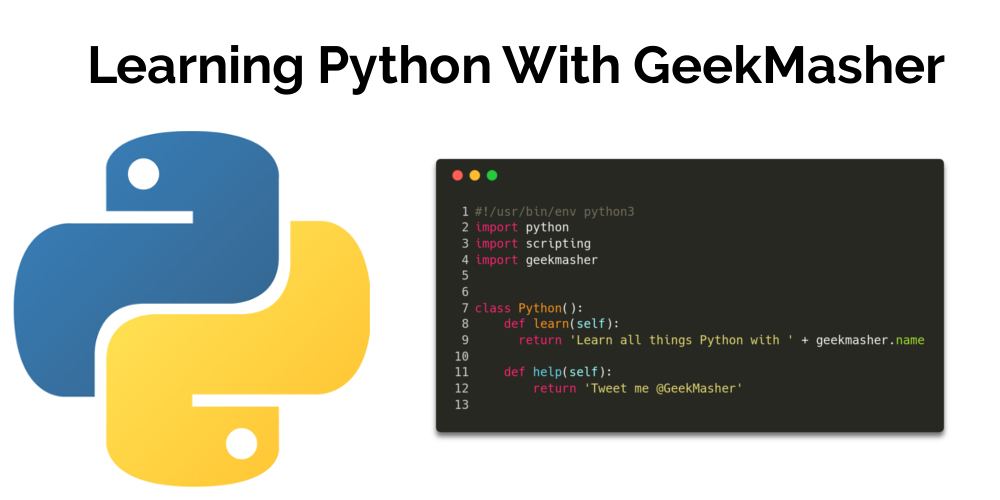

# 30DaysCoding-Python

[GeekMasher's 30 Days of Python Coding Repo](https://blog.geekmasher.com/30DaysCoding/python/)

Over the course of April 2018, I will be doing 30 Days of coding in Python to both teach myself more about the language and assist others that want to learn.
This hopefully will improve my Python skills and teach others from the basics to more advanced Python coding.

I will be starting this on the 1st of April opening with a post about All Things Python.

This repo is used for any code this is written over the course of these 30 days.
Everyday might not have code snippets in this repo but there will be a post on my blog found [here](https://blog.geekmasher.com/30DaysCoding/python/).

## Posts:

Stay Tuned!
